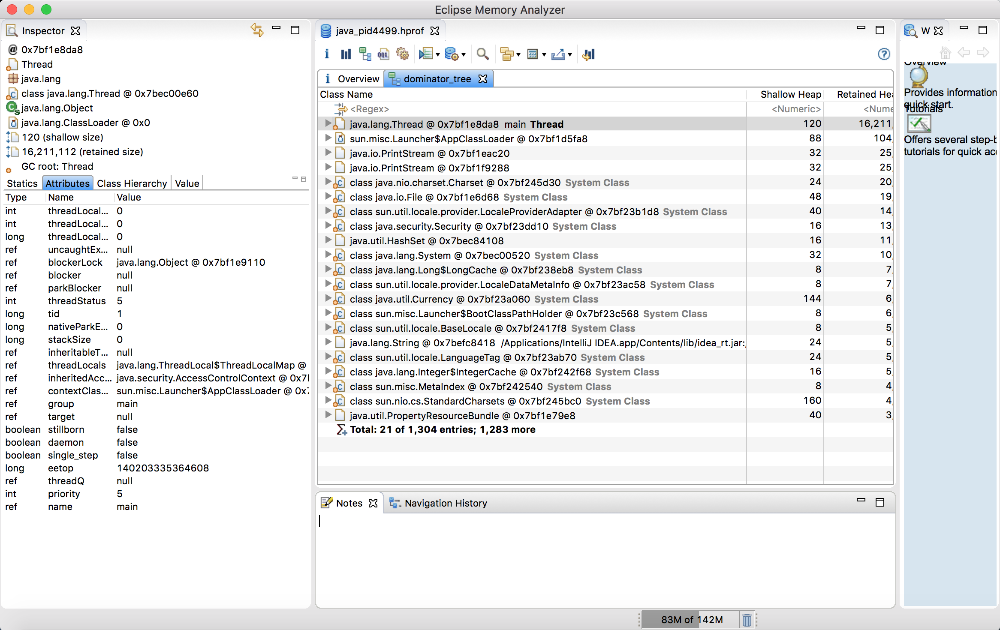

## 内存溢出场景模拟

1. 问题产生：编写测试类，通过死循环模拟内存溢出
	```java
	/**
     * 测试内存溢出
     * 抛出异常，java.lang.OutOfMemoryError: Java heap space
     */
    @Test
    public void test1() {
        List<Demo> demoList = new ArrayList<>();

        // 模拟内存溢出
        while (true) {
            demoList.add(new Demo());
        }
    }
	```

2. 问题分析

	2.1 设置JVM参数
		
		导出堆快照信息: -XX:+HeapDumpOnOutOfMemoryError
		设置最大及最小内存: -Xms20m -Xmx20m

	2.2 使用分析工具MAT(Memory Analyzer Tool)进行分析

		官网地址：http://www.eclipse.org/mat/
		下载地址：http://www.eclipse.org/mat/downloads.php

3. 分析结果展示

	


