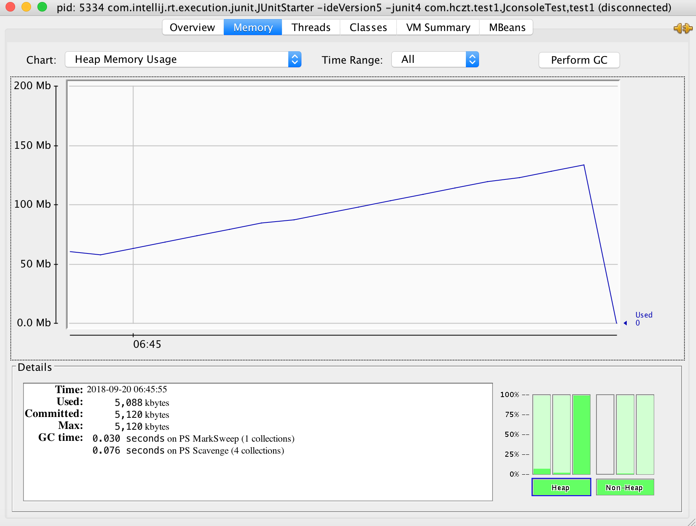
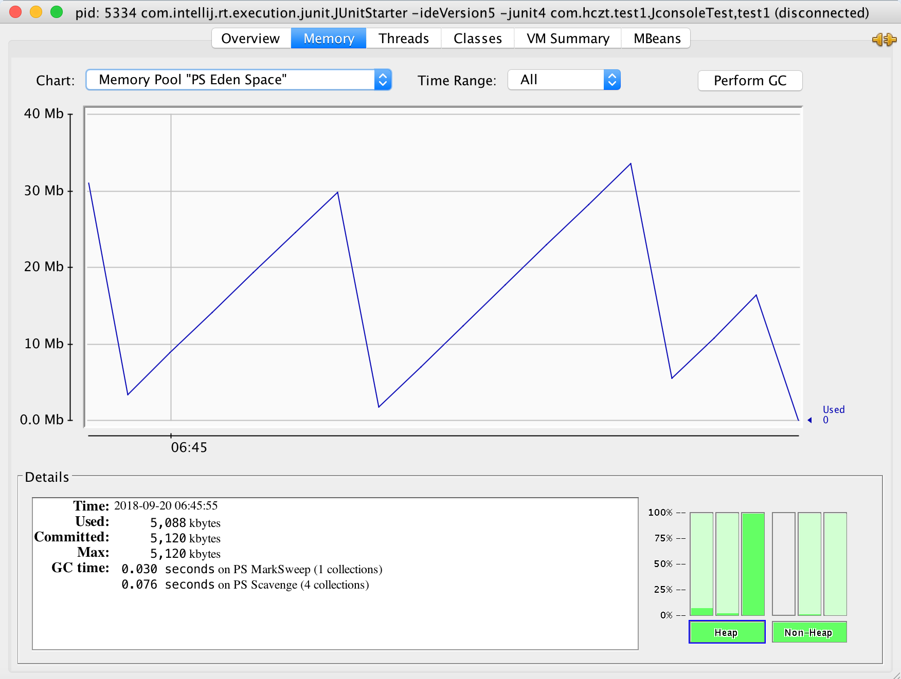
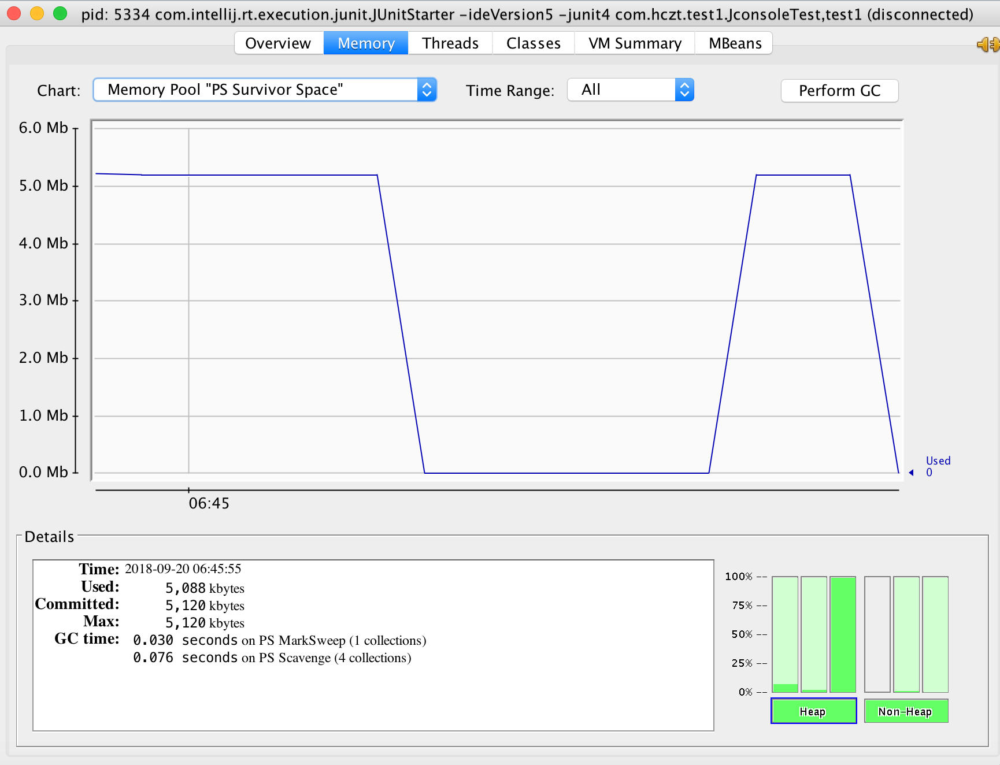

## JVM 可视化监控工具

JVM 自带 Jconsole 可视化监控工具，如果已经配置好了环境变量，可以直接在终端中使用`jconsole`命令启动。

* 示例代码

```java
public class JconsoleTest {

    // 为了多占用内存空间，声明一个成员变量
    private byte[] b1 = new byte[128*1024];

    @Test
    public void test1() {
        // 连接Jconsole，睡眠5秒
        try {
            Thread.sleep(5000);
        } catch (InterruptedException e) {
            e.printStackTrace();
        }
        System.out.println("start...");
        fill(1000);
    }

    private void fill(int n) {
        List<JconsoleTest> jlist = new ArrayList<>();
        for (int i=0; i < n; i++) {
            // 便于观察结果，每次循环眨眼100ms
            try {
                Thread.sleep(100);
            } catch (InterruptedException e) {
                e.printStackTrace();
            }
            jlist.add(new JconsoleTest());
        }
    }
}
```

* 结果分析展示

	* 内存整体使用情况

	

	* Edge区使用情况
	
	

	* Survivor区使用情况

	