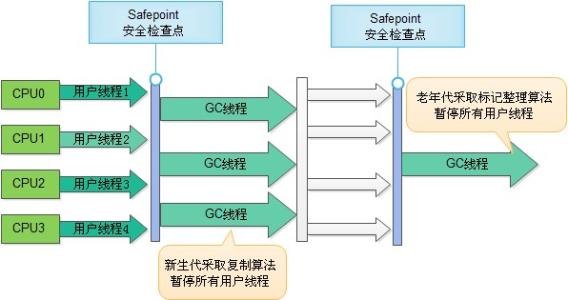

## ParNew收集器

ParNew收集器是Serial收集器新新生代的多线程实现，在进行垃圾回收的时候依然会stop the world，只是相比较Serial收集器而言，它会运行多条进程进行垃圾回收。

* 特性

	ParNew收集器是Serial收集器的**多线程版本**,除了使用多条线程进行垃圾收集之外，其余行为包括Serial收集器可用的所有控制参数、收集算法、Stop The World、对象分配规则、回收策略等都与Serial收集器完全一样，在实现上，这两种收集器也共用了相当多的代码。

* 应用场景

	ParNew收集器是许多运行在Server模式下的虚拟机中首选的新生代收集器。很重要的原因是：除了Serial收集器外，目前只有它能与CMS收集器配合工作。在JDK1.5时期，HotSpot推出了一款在强交互应用中几乎可认为有划时代意义的垃圾收集器-CMS收集器，这款收集器是HotSpot虚拟机中第一款真正意义上的并发收集器，它第一次实现了让垃圾收集线程与用户线程同时工作。不幸的是，CMS作为老年代的收集器，却无法与JDK1.4.0中已经存在的新生代收集器Parallel Scavenge配合工作，所以在JDK1.5中使用CMS来收集老年代的时候，新生代只能选择ParNew或者Serial收集器中的一个。