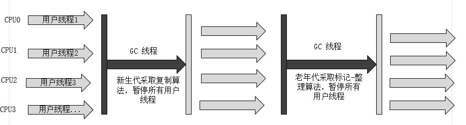

## Serial 收集器

Serial收集器是最基本、发展历史最悠久的收集器，在JDK1.3.1之前是虚拟机新生代收集的唯一选择。

* 特性

	**单线程**收集器，只用一个CPU或一条收集线程去完成GC工作，且在进行垃圾收集时必须暂停其他所有的工作线程（"Stop The World"，简称STW），直到它收集结束。

* 应用场景

	Serial收集器是虚拟机在运行Client模式下的默认新生代收集器

* 优势

	简单而高效（与其他收集器的单线程比），对于限定单个CPU的环境来说，Serial收集器由于没有线程交互的开销，专心做垃圾收集自然可以获得最高的单线程收集效率。