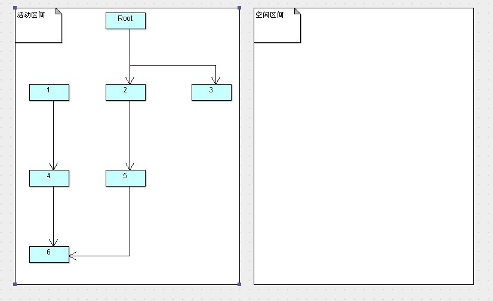
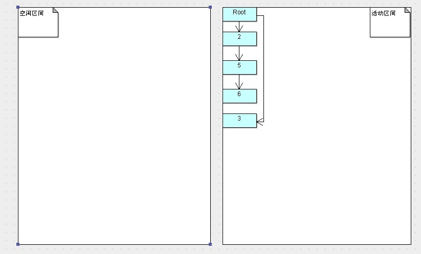

## 复制算法(Copying)

* JVM 内存管理
	* 线程共享区
		* 堆
			* 新生代
				* Eden 伊甸园
				* Survivor 存活区
				* Tenured Gen
			* 老年代
		* 方法区
	* 线程独占区
		* 虚拟机栈
		* 本地方法栈
		* 程序计数器

* 复制算法

	复制算法将内存划分为两个区间，在做任意时间点，所有动态分配的对象都只能分配在其中一个区间（称为活动区间），而另外一个区间（称为空闲区间）则是空闲的。

	当有效内存空间耗尽时，JVM将暂停程序运行，开启复制算法GC线程。接下来GC线程会将活动区间内的存活对象，全部复制到空闲区间，且严格按照内存地址依次排序，与此同时，GC线程将更新存活对象的内存引用地址指向亲的内存地址。

	此时，空闲区间已经与活动区间交换，而垃圾对象现在已经全部留在了原来的活动区间，也就是现在的空闲区间。事实上，在活动区间转换为空闲区间的同时，垃圾对象已经被一次性全部回收。

	* 流程

	内存划分为两个区间，所有动态分配的对象只分配在一个区间中。

	

	当有效内存空间耗尽时，开启复制算法GC线程处理之后

	

	* 优点

	弥补了标记/清除算法中，内存布局混乱的缺点

	* 缺点

	**空间浪费：**可用内存缩减为原来的一半，太过浪费（解决：可以改良，不按1:1比例划分）

	**效率随对象存活率升高而变低：**当对象存活率较高时，需要进行较多的复制操作，效率将会变低（解决：标记-整理算法）

	* 适用场景

	对象的存活率要非常低，而且必须要克服50%内存的浪费

* 优化的复制算法（HotSpot虚拟机**新生代内存布局及算法**）

	在复制算法的基础上，使用3个分区进行处理。3个分区分别为：1个Eden区和2个Survivor区（分别叫作from 和 to）。默认比例为 8:1:1。

	一般情况下，新创建的对象都会被分配到Eden区（一些大对象特殊处理）,这些对象经过第一次 Minor GC 后，如果仍然存活，将会被移到Survivor区。对象在Survivor区中每熬过一次 Minor GC，年龄就会增加1岁，当它的年龄增加到一定程度时，就会被移动到年老代中。

	年轻代中的对象基本都是朝生夕死的，所以在年轻代的垃圾回收算法使用的是复制算法，复制算法的基本思想就是将内存分为两块，每次只用其中一块，当一块内存用完，就将还活着的对象复制到另外一块上面。复制算法不会产生内存碎片。

	在GC开始的时候，对象只会存在于Eden区和名为"From"的Survivor区，Survivor区"To"是空的。紧接着进行GC，Eden区中所有存活的对象都会被复制到"To"，而在"From"区中，仍存活的对象会根据他们的年龄值来决定去向。年龄达到一定值（年龄阈值，可以通过-XX:maxTenuringThreshold来设置）的对象会被移动到年老代中，没有达到阈值的对象会被复制到"To"区域。经过这次GC后，Eden区和From区已被清空。这个时候，"From"和"To"会交换他们的角色，也就是新的"To"就是上次GC前的"From"，新的"From"就是上次GC前的"To"。不管怎样，都会保证名为To的Survivor区域是空的。Minor GC会一直重复这样的过程，直到"To"区被填满，"To"区填满之后，直接通过（分配担保机制：Handle Promotion）将所有对象移动到年老代中。

	