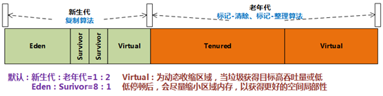

## 分代收集算法(Generational Collection)

当前商业虚拟机都采用此算法。在前面三种算法的基础上，面对不同情况而选择不同的算法。该算法根据对象的存活周期的不同，将内存划分为几块。一般是把Java堆分为**新生代**和**老年代**，根据各个年代的特点采用最适当的收集算法。

在**新生代**中，每次垃圾收集时都发现有大批对象死去，只有少量存活，选用**复制算法**，只需要付出少量存活对象的复制成本就可以完成收集。

在**老年代**中，因为对象存活率高、没有额外空间对它进行分配担保，就使用**标记-整理**算法来进行回收。

**方法区永久代**,回收方法同老年代。

HotSpot虚拟机一般的年代内存划分如下：
