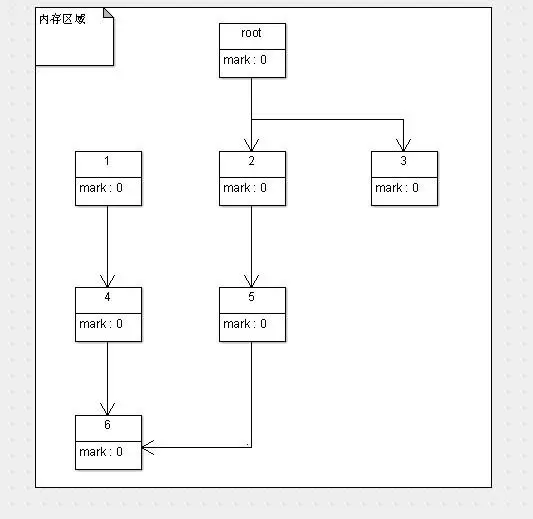

## 标记-整理算法(Mark-Compact)

标记/整理算法与标记/清除算法非常相似，它也是分为两个阶段：标记和整理

标记：它的第一个阶段与标记/清除算法是一模一样的，均是遍历GC Roots，然后将存活的对象标记。

整理：移动所有存活的对象，且按照内存地址次序依次排列，然后将末端内存地址以后的内存全部回忆。

* 流程

	* 程序运行初期，所有对象的状态标记位全部是0（也就是未标记，以下默认0是未标记，1为已标记）

	

	* 程序运行一段时间后，**有效内存空间耗尽了**，JVM将会停止应用程序的运行并开启GC线程，按照可达性分析算法(根搜索算法)，进行标记工作

	![mark-compact2]](./../../pic/GC/Recycling/mark-compact2.webp)

	* 根据根搜索算法，所有从root对象可达的对象就被标记为存活对象，此时完成第一阶段标记。

	* 完成标记工作后，执行第二阶段整理工作。整理阶段处理完后，内存布局如下：
	
	![mark-compact3]](./../../pic/GC/Recycling/mark-compact3.webp)

	* 整理完成后，标记的存活对象会按照内存地址依次排列，而未被标记的内存会被 清理掉。当需要给新对象分配内存时，JVM只需要持有一个内存的起始地址即可，这比维护一个空闲列表少了许多开销。

*  优点

	* 弥补了标记/清除算法当中内存区域分散的缺点

	* 消除了复制算法当中内存减半的高额代价

* 缺点

	* 效率不高，不仅要标记所有存活对象，还要整理所有存活对象的引用地址。
