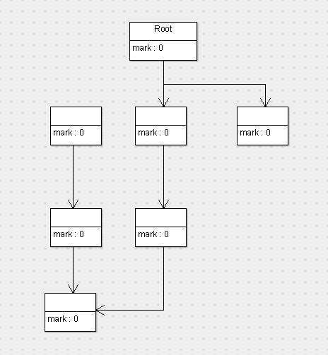

## 标记-清除算法(Mark-Sweep)

标记-清除算法(mark-sweep)的做法是当堆中的有效内存空间(avaliable memory)被耗尽的时候，就会停止整个程序，然后进行两项工作，第一项是标记，第二项则是清除。

标记：标记的过程就是遍历所有的 GC Roots，然后将所有 GC Roots 可达的对象标记为存活的对象。

清除：清除的过程将遍历堆中所有的对象，将没有标记的对象全部清除掉。

标记清除算法就是当程序运行期间，若可以使用的内存被耗尽的时候，GC 线程就会被触发并将程序暂停，随后将依旧存活的对象标记一遍，最终再将堆中所有没被标记的对象全部清除掉，接下来便让程序恢复运行。

* 流程

	* 程序运行初期，所有对象的状态标记位全部是0（也就是未标记，以下默认0是未标记，1为已标记）

	

	* 程序运行一段时间后，**有效内存空间耗尽了**，JVM将会停止应用程序的运行并开启GC线程，按照可达性分析算法(根搜索算法)，进行标记工作

	![mark-sweep2]](./../../pic/GC/Recycling/mark-sweep2.jpg)

	* 根据根搜索算法，所有从root对象可达的对象就被标记为存活对象，此时完成第一阶段标记。

	* 完成标记工作后，执行第二阶段清除，清除完以后，剩下对象以及对象的状态如下：

	![mark-sweep3]](./../../pic/GC/Recycling/mark-sweep3.jpg)

	* 没有被标记的对象将会回收清除掉，而被标记的对象将会留下，并且会将标记重新归0。然后唤醒停止的程序线程，让程序继续运行。

* 优点
	
	* 基于最基础的可达性分析算法，它是**最基础的收集算法**
	* 后续的收集算法都是基于这种思路并对其不足进行改进得到的

* 缺点
	* 效率比较低（递归与全堆对象遍历），而且在进行GC的时候，需要停止应用程序，会导致用户体验非常差劲
	* 清理出来的内存是不连续的。死亡对象都是随即的出现在内存的各个角落，把它们清除后，内存的布局自然会乱七八糟。
