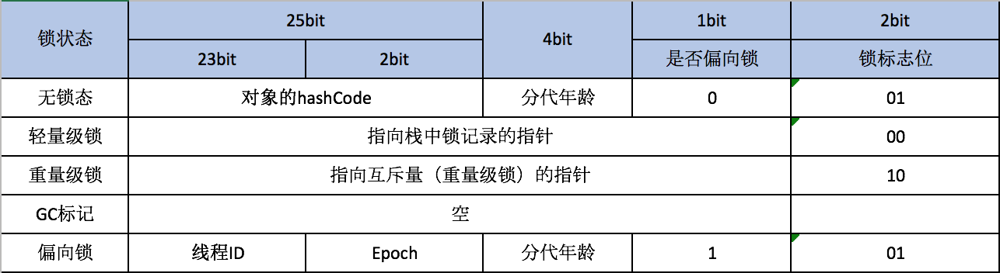

## 结构

* Header (对象头)

	* 自身运行时数据(Mark Word)
		* 哈希值
		* GC分代年龄
		* 锁状态标志
		* 线程持有的锁
		* 偏向线程ID
		* 偏向时间戳

	* 类型指针
		* 对象指向源数据的指针，并不是必须的
		* 对于数据类型的数据，还会保存一个数据长度的数据

* InstanceData

	* HotSpot虚拟机：相同长度的字段分配到一起

* Padding

	* 填充内存

## HotSpot 虚拟机对象头 Mark Word

