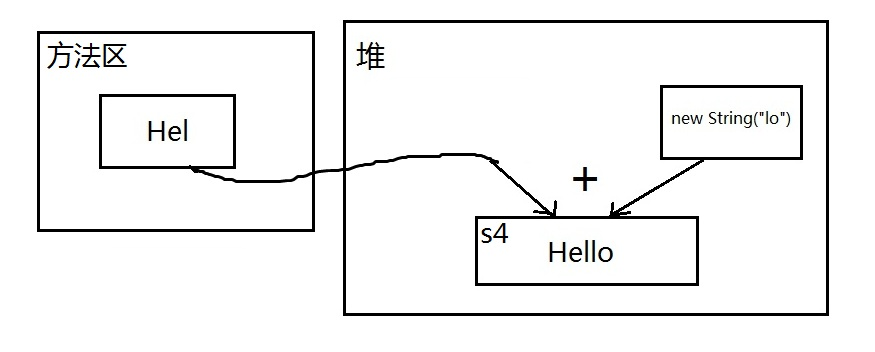
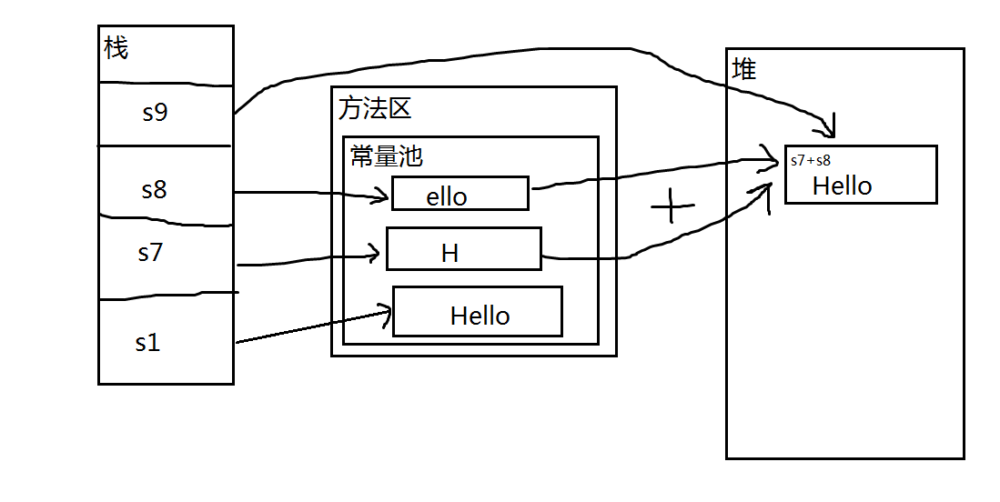

## 常量池

Java 中的常量池，分为两种：**静态常量池**和**运行时常量池**

**静态常量池**：即`*.class` 文件中的常量池，`class`文件中的常量池不仅仅包含字符串(数字)字面量，还包含类、方法的信息，占用`class`文件绝大部分空间。

**运行时常量池**：则是 jvm 虚拟机在完成类装载操作后，将 class 文件中的常量池载入到内存中，并保存在**方法区**中，一般说的常量池，指的就是方法区中的运行时常量池。

* 示例

```java
@Test
public void test() {
    String s1 = "Hello";
    String s2 = "Hello";
    String s3 = "Hel" + "lo";
    String s4 = "Hel" + new String("lo");
    String s5 = new String("Hello");
    String s6 = s5.intern();
    String s7 = "H";
    String s8 = "ello";
    String s9 = s7+s8;

    System.out.println(s1 == s2); // true
    System.out.println(s1 == s3); // true
    System.out.println(s1 == s4); // false
    System.out.println(s1 == s9); // false
    System.out.println(s4 == s5); // false
    System.out.println(s1 == s6); // true
}
```

* 分析

	* `s1 == s2` : s1、s2 在赋值时，均使用字符串字面量(直接把字符串写死)，在编译期间，字面量会直接放入class文件的常量池中，从而实现复用，载入运行时常量池后，s1、s2指向的是同一个内存地址，所以相等。

	* `s1 == s3` : s3 虽然是动态拼接出来的字符串，但是所有参与拼接的部分都是已知的字面量，在编译期间，这种拼接会被优化，编译器会直接接好，因此`String s3 = "Hel" + "lo";` 在class文件中被优化成 `String s3 = "Hello";`，所以s1 == s3 成立。

	* `s1 == s4` : s4 虽然也是拼接出来的，但是`new String("lo");`这部分不是已知的字面量，是一个不可预料的部分，编译器不会优化，必须等到运行时才可以确定结果，结合**字符串不变**理论，地址肯定不同。
	

	* `s1 == s9` : 虽然s7、s8在赋值的时候使用的字符串字面量，但是拼接成s9的时候，s7、s8作为两个变量，都是不可预料的，编译器不做优化，等到运行时，s7、s8拼接成新的字符串，在堆地址中不确定，不可能与方法区常量池中的s1地址相同
	

	* `s4 == s5` : 两者都在堆中，但地址不同。

	* `s1 == s6` : s5在堆中，内容为Hello,intern方法会尝试将Hello字符串添加到常量池中，并返回其在常量池中的地址，因为常量池中已经有了Hello字符串，所以intern方法直接返回地址；而s1在编译期就已经指向常量池了，因此s1和s6指向同一地址，相等。

* 结论

	* 必须要关注编译期的行为，才能更好地理解常量池

	* 运行时常量池中的常量，基本来源于各个class文件中的常量池

	* 程序运行时，除非手动向常量池中添加常量（比如调用intern方法），否则jvm不会自动添加常量到常量池

* 说明
	
	以上示例仅涉及字符串常量池，实际上还有整型常量池，浮点型常量池等等，但都大同小异，只不过数值类型的常量池不可以手动添加常量，程序启动时常量池中的常量就已经确定了。比如整型常量池中的常量范围：-128 ~ 127，只有这个范围内的数字可以用到常量池。